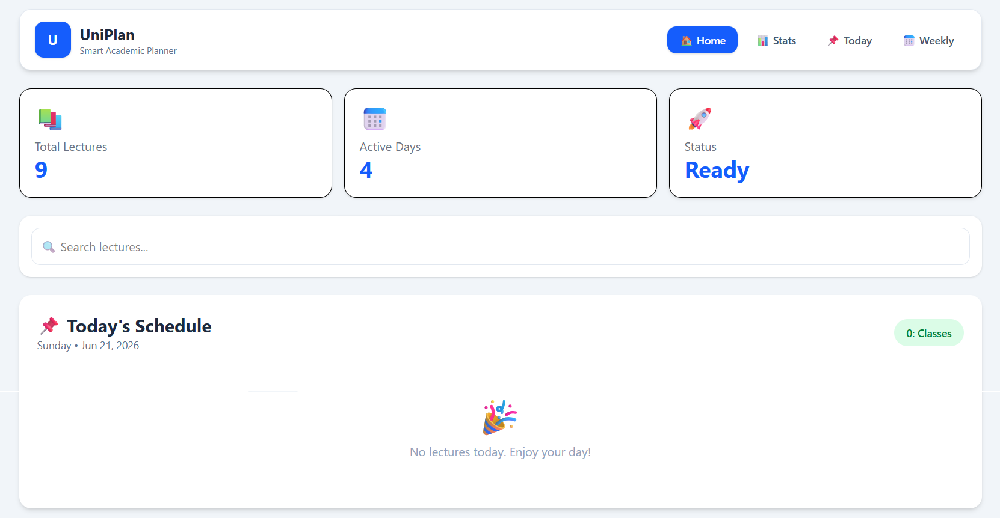
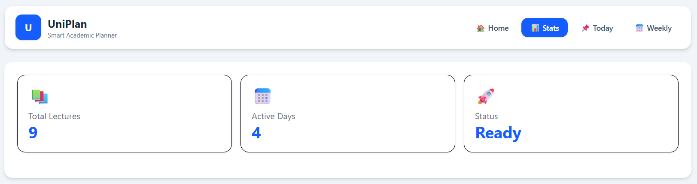
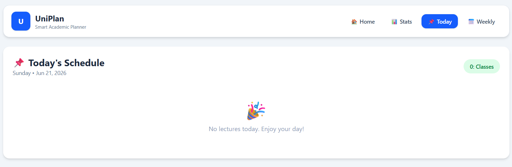
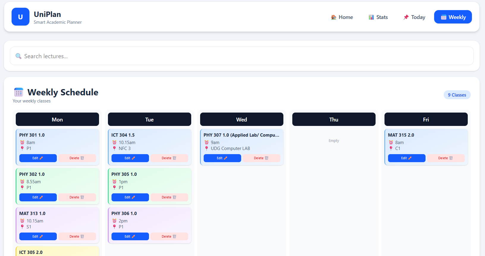
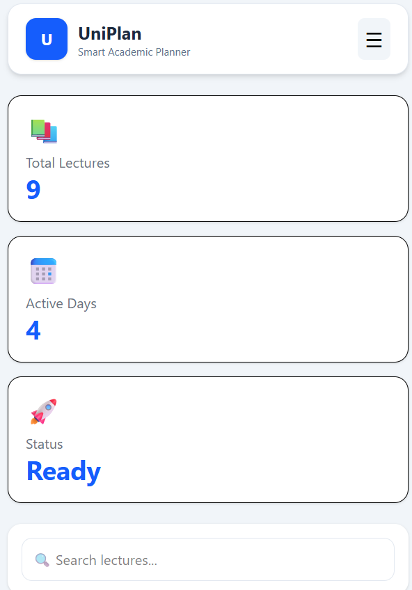

# 🎓 UniPlan - Academic Timetable Manager

UniPlan is a modern and responsive timetable management application designed for university students. It helps users organize lectures, manage weekly schedules, track daily classes, and maintain an efficient academic routine.

Built with React and Tailwind CSS, UniPlan provides a clean and user-friendly dashboard experience across desktop, tablet, and mobile devices.

---

## 🚀 Features

### 📅 Weekly Timetable

* View lectures organized by weekdays
* Color-coded lecture cards
* Responsive timetable layout
* Edit and delete existing lectures

### 📌 Today's Schedule

* Automatically displays lectures scheduled for the current day
* Quick overview of upcoming classes
* Clean and minimal design

### 📊 Statistics Dashboard

* Total number of lectures
* Academic schedule insights
* Easy-to-read statistics cards

### 🔍 Search Functionality

* Search lectures instantly by subject name
* Real-time filtering

### ✏️ Lecture Management

* Add new lectures
* Update lecture details
* Delete lectures
* Persistent local storage support

### 📱 Responsive Design

* Desktop optimized
* Tablet friendly
* Mobile responsive navigation
* Hamburger menu support

---

## 🛠️ Tech Stack

### Frontend

* React
* JavaScript (ES6+)
* Tailwind CSS

### State Management

* React Hooks

  * useState
  * useEffect

### Storage

* Local Storage API

---

🎮 Demo
Live Demo: https://danu-codes.github.io/student-timetable-manager/

---

## 📂 Project Structure

src │ ├── components │ │ │ ├── Navbar.jsx │ │ └── Responsive navigation bar with page switching │ │ │ ├── Stats.jsx │ │ └── Displays timetable statistics and overview cards │ │ │ ├── LectureForm.jsx │ │ └── Form for adding new lectures │ │ │ ├── TodaySchedule.jsx │ │ └── Shows lectures scheduled for the current day │ │ │ ├── Timetable.jsx │ │ └── Weekly timetable view with edit and delete actions │ │ │ └── EditModal.jsx │ └── Modal for updating lecture information │ ├── App.jsx │ └── Main application component and state management │ ├── main.jsx │ └── React application entry point │ ├── App.css │ └── Global application styles │ └── index.css └── Tailwind CSS configuration and utility imports

---

## ⚡ Installation

Clone the repository:

```bash
git clone https://github.com/your-username/uniplan-timetable-manager.git
```

Navigate to the project directory:

```bash
cd uniplan-timetable-manager
```

Install dependencies:

```bash
npm install
```

Run the development server:

```bash
npm run dev
```

---

## 🎯 Learning Outcomes

This project was developed to practice:

* React component architecture
* State management with Hooks
* CRUD operations
* Responsive UI design
* Tailwind CSS styling
* Local storage integration
* Dashboard design principles

---

## 📸 Screenshots

Add screenshots of:

* Home Dashboard



* Statistics Page



* Today's Schedule



* Weekly Timetable



* Mobile Responsive View



---

## 🌟 Future Improvements

* Dark mode support
* Drag-and-drop timetable editing
* Lecture notifications
* Authentication system
* Cloud database integration
* Export timetable as PDF
* Calendar synchronization

---

## 👨‍💻 Author

Developed by DANUSHAN

If you found this project useful, consider giving it a ⭐ on GitHub.
